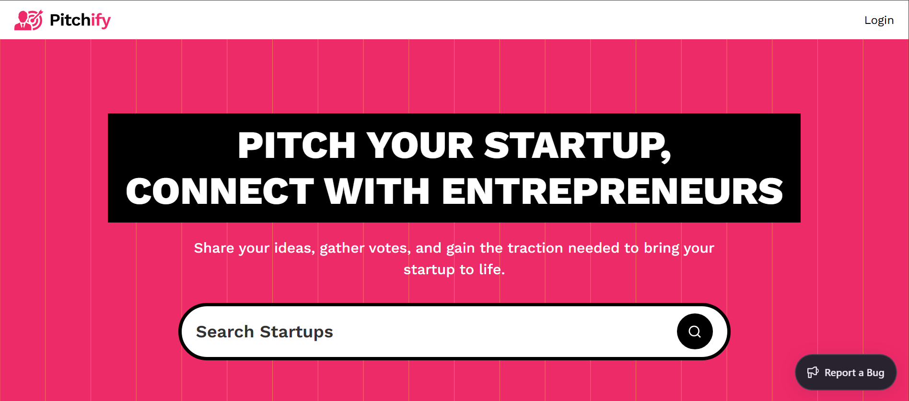

# 📌 PITCHIFY – Pitch Your Startup, Get Noticed!



🚀 **Pitchify** is a platform for entrepreneurs to **share startup ideas**, **connect with like-minded individuals**, and **vote on pitches** to highlight the most promising startups. Whether you're an innovator looking for feedback or an investor scouting for ideas, **Pitchify** brings the startup community together!

---

## ✨ Features

✅ **User Authentication** – Sign up and log in to manage your startup pitches.  
✅ **Create Pitches** – Share your startup ideas with the community.  
✅ **Search & Filter** – Easily discover ideas based on categories.  
✅ **Pitch Markdown Support** – Format your startup pitches beautifully.  
✅ **View Counter** – Track pitch popularity.  
✅ **Responsive UI** – Seamless experience across devices.  
✅ **Error Monitoring** – Integrated with **Sentry** to track and resolve issues.

---

## 🛠️ Tech Stack

- **Framework:** [Next.js](https://nextjs.org/) ([React](https://react.dev/))
- **Content Management:** [Sanity.io](https://www.sanity.io/)
- **Styling:** [Tailwind CSS](https://tailwindcss.com/plus)
- **Authentication:** [NextAuth.js](https://next-auth.js.org/)
- **Monitoring & Bug Tracking:** [Sentry](https://sentry.io/welcome/)
- **Hosting:** [Vercel](https://vercel.com/)

---

## 🚀 Getting Started

### 1️⃣ Clone the Repository

```sh
git clone https://github.com/yourusername/pitchify.git
cd pitchify
```

### 2️⃣ Install Dependencies

```sh
pnpm install
```

### 3️⃣ Set Up Environment Variables

```ini
AUTH_SECRET=
AUTH_GOOGLE_ID=
AUTH_GOOGLE_SECRET=
NEXT_PUBLIC_SANITY_PROJECT_ID=
NEXT_PUBLIC_SANITY_DATASET=
NEXT_PUBLIC_SANITY_API_VERSION=
SANITY_WRITE_TOKEN=
```

### 4️⃣ Run the Project

```sh
pnpm dev
```

## 🔮 Future Improvements

🚧 **Planned Features:**  
🔹 **User Profiles** – Users will be able to modify their profiles.  
🔹 **Dark Mode** – A theme toggle for a better user experience.  
🔹 **Editing Pitches** – Users will be able to update their startup ideas.  
🔹 **Deleting & Upvoting Pitches** – Users will be able to remove and vote on startup ideas.

---

## 📬 Contact

💡 Have feedback or suggestions? Reach out on:  
📩 **Email:** [amin.nassar.ce@gmail.com](mailto:amin.nassar.ce@gmail.com)  
🐦 **Twitter:** [@devAminNassar](https://x.com/devAminNassar)  
💼 **LinkedIn:** [Amin Nassar](https://www.linkedin.com/in/amin-m-nassar/)
